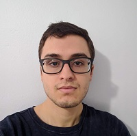

# Welcome to my personal site

My name is Pablo Gratas! I'm curerntly a 3rd year transfer student at UCSD persuing a degree in computer science. I also *love* cooking, cycling, tv, movies, video games, among other hobbies.
I've lived in Valencia, CA for most of my life, and before UCSD, I went to the local community college, COC, to get degrees in

* Computer Science
* Math
* Physics
* Economics

In my educational journey, I've had to use a variety of languages, and my favorite right now are:

1. C++
2. C
3. Python

Java doesn't make it on to this list because I have `public static void main(String[] args)` seared into my brain, and I'd prefer if I didn't. 
All jokes aside, I do enjoy learning new languages, and I try to hone the ones I already do. I'm also interested in different branches of CS like:
* Game development 
* Machine learning 
* Computer graphics 
* User experience

In terms of my academic progress, I have goals I've completed, but many I have not yet:

- [x] Complete my high school degree
- [x] Complete my college degrees
- [ ] Complete my bachelors
- [ ] Complete my masters

As more updates come in, I'll be updating this with relevant information. Let's close out with a favorite quote of mine from Kanye West:
> Reach for the stars, so if you fall, you land on a cloud

[email](mailto:pgratas@ucsd.edu)

[GitHub](https://github.com/PabloGratas)

[Return to top](https://github.com/PabloGratas/PabloGratas.github.io/new/main#welcome-to-my-personal-site)
